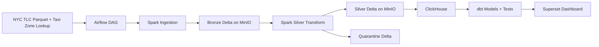

# NYC Taxi Data Platform

Engineering-grade compact data platform for the Nexlab Data Engineer Internship Entrance Project.

## Overview

This project builds an end-to-end batch data platform on NYC TLC Yellow Taxi Trip Records and Taxi Zone Lookup data. The target path is:

1. Ingest NYC TLC Parquet files into Bronze Delta tables on MinIO.
2. Transform, validate, deduplicate, and quarantine bad records with Apache Spark.
3. Load Silver data into ClickHouse.
4. Build dbt staging, dimensions, facts, and analytics marts.
5. Serve a Superset dashboard from ClickHouse.
6. Orchestrate the whole flow with Airflow.

The priority is a small, complete, explainable pipeline rather than a wide but fragile demo.

## Architecture

See [docs/design.md](docs/design.md) and [docs/architecture.mmd](docs/architecture.mmd).



## Quick Start

Local setup should stay within five steps:

1. Copy `.env.example` to `.env` and adjust local ports or credentials if needed.
2. Run `make docker-up`.
3. Run `make pipeline-sample` for the small test path.
4. Run `make dbt-run && make dbt-test`.
5. Open Superset and review the dashboard.

## Current Phase

Phase 2 adds the local Docker Compose stack. Pipeline implementation starts in later phases.

## Commands

```bash
python -m pip install -r requirements-dev.txt
make lint
make format
make test
make docker-up
make docker-logs
make docker-down
make dataset-check
make ingest-bronze-sample
make transform-silver-sample
make create-clickhouse-tables
make load-clickhouse-sample
make pipeline-sample
make dbt-seed
make dbt-run
make dbt-test
make dbt-docs
```

On Windows machines without `make`, run the equivalent commands directly:

```powershell
python -m ruff check src tests dags scripts
python -m black --check src tests dags scripts
python -m pytest
docker compose --env-file .env up -d
docker compose --env-file .env logs -f --tail=200
docker compose --env-file .env down
python scripts/check_dataset_size.py
python -m nyc_taxi_pipeline.cli ingest-bronze --start-month 2023-01 --end-month 2023-01 --sample-mode --skip-head
python -m nyc_taxi_pipeline.cli transform-silver
docker compose --env-file .env exec -T clickhouse clickhouse-client --queries-file /opt/project/scripts/create_clickhouse_tables.sql
python -m nyc_taxi_pipeline.cli load-clickhouse
dbt seed --project-dir dbt/nyc_taxi --profiles-dir dbt/nyc_taxi
dbt run --project-dir dbt/nyc_taxi --profiles-dir dbt/nyc_taxi
dbt test --project-dir dbt/nyc_taxi --profiles-dir dbt/nyc_taxi
```

## Docker Stack

Create a local environment file before starting services:

```bash
cp .env.example .env
docker compose --env-file .env config
make docker-up
make docker-logs
make docker-down
```

The Compose stack starts:

- MinIO object storage.
- Spark master and one Spark worker.
- ClickHouse serving database.
- Airflow Postgres metadata database.
- Airflow webserver and scheduler.
- Superset BI server.

The stack uses a shared Docker network and named volumes for service state. Local values in `.env.example` are development-only defaults and should be changed before any non-local deployment.

## Dataset Policy

Production/default runs must use enough NYC TLC Yellow Taxi monthly files to satisfy at least one threshold:

- at least 20 million records, or
- at least 10 GiB raw data.

Small samples are allowed only for unit and integration tests. A validation script will fail fast if the configured production month range does not meet the threshold.

Run the dataset gate before a full pipeline run:

```bash
python scripts/check_dataset_size.py
```

The checker discovers NYC TLC Yellow Taxi Parquet URLs from `DATASET_START_MONTH` and `DATASET_END_MONTH`, then validates the selected files. It uses HTTP `HEAD` requests for `Content-Length` where available. Because public Parquet files are compressed and may not reach the 10 GiB raw-size threshold, `configs/pipeline.yml` also stores month-level record-count metadata for the default 2023 full-mode range.

`SAMPLE_MODE=true` is only for CI, unit/integration tests, or a fast local smoke run. In sample mode the threshold is skipped with a warning log. Do not present sample mode as the production dataset.

## Configuration, Logging, and Metrics

Pipeline jobs read configuration from `configs/pipeline.yml` plus environment variables. For local runs, copy `.env.example` to `.env`; process environment variables override values from `.env`.

`configs/pipeline.yml` may reference variables with `${VAR_NAME}`. Secrets such as MinIO credentials stay in `.env` and are not embedded in source code.

Structured logs are JSON objects with fields such as `event`, `job_name`, `batch_id`, `timestamp`, `level`, and job-specific metadata. Metrics are written as JSONL to `METRICS_OUTPUT_PATH`, which defaults to `metrics/pipeline_metrics.jsonl`.

Standard metrics include:

- `job_duration_seconds`
- `records_processed`
- `invalid_records_count`
- `duplicates_dropped`
- `data_freshness_hours`

## Bronze Ingestion

Bronze ingestion reads NYC TLC Yellow Taxi Parquet files with Spark and writes a Delta table to `BRONZE_DELTA_PATH`, which defaults to `s3a://nyc-taxi/bronze/yellow_taxi_trips`.

Each Bronze row receives lineage metadata:

- `source_file`
- `source_url`
- `ingestion_timestamp`
- `batch_id`
- `dataset_year`
- `dataset_month`

The Bronze table is partitioned by `dataset_year` and `dataset_month` because NYC TLC files are delivered by month. This keeps reruns scoped to a source month and avoids rewriting unrelated data.

Idempotency is handled with a JSONL manifest at `INGESTION_MANIFEST_PATH`. If a source URL has a successful manifest entry, reruns skip it. For a source that must be ingested, the job performs a controlled Delta delete for existing rows with the same `source_url`, then appends the new rows. It never overwrites the whole Bronze table.

Run a small Bronze smoke command with:

```bash
python -m nyc_taxi_pipeline.cli ingest-bronze --start-month 2023-01 --end-month 2023-01 --sample-mode --skip-head
```

The command still uses Spark as the ingestion engine. Sample mode only bypasses the dataset threshold gate; it is not the production dataset.

## Silver Transform And Quarantine

Silver transformation reads Bronze Delta, normalizes NYC TLC source columns to snake_case, casts expected data types, creates deterministic `trip_id`, derives time and speed fields, validates business rules, and deduplicates valid trips.

Validation failures are written to Quarantine Delta at `QUARANTINE_DELTA_PATH` with:

- `error_reason`
- `quarantine_timestamp`
- `batch_id`
- `source_file`

Valid records are merged into Silver Delta at `SILVER_DELTA_PATH` by `trip_id`. Late-arriving records update existing trips only when their `ingestion_timestamp` is newer than the target row. New trip ids are inserted.

Silver metrics include `records_read`, `valid_records_count`, `invalid_records_count`, `invalid_records_ratio`, `duplicates_dropped`, and `job_duration_seconds`.

Run the transform after Bronze ingestion:

```bash
python -m nyc_taxi_pipeline.cli transform-silver
```

## ClickHouse Serving Load

ClickHouse stores cleaned Silver records in `nyc_taxi.silver_yellow_taxi_trips`, created by [scripts/create_clickhouse_tables.sql](scripts/create_clickhouse_tables.sql).

The table uses `MergeTree`, partitions by `toYYYYMM(pickup_datetime)`, and orders by `(pickup_date, pickup_location_id, dropoff_location_id, trip_id)`. This layout matches the dashboard and dbt access patterns: time-series analysis, location filters, and trip-level idempotency checks.

Create the table:

```bash
make create-clickhouse-tables
```

Load Silver into ClickHouse:

```bash
python -m nyc_taxi_pipeline.cli load-clickhouse
```

The load is idempotent at the month-partition level. The loader reads affected `pickup_datetime` months from Silver, runs a ClickHouse `ALTER TABLE ... DELETE WHERE toYYYYMM(pickup_datetime) IN (...) SETTINGS mutations_sync = 2`, then appends the current Silver rows through Spark JDBC. This is more deterministic for dbt and Superset than relying on eventual background deduplication.

## dbt Star Schema

dbt models live in [dbt/nyc_taxi](dbt/nyc_taxi). The project reads `nyc_taxi.silver_yellow_taxi_trips` from ClickHouse and builds:

- staging views: `stg_yellow_taxi_trips`, `stg_taxi_zones`
- core star schema: `fact_trips`, `dim_date`, `dim_time`, `dim_location`, `dim_vendor`, `dim_payment_type`, `dim_rate_code`
- analytics marts: `mart_daily_revenue`, `mart_hourly_demand`, `mart_location_performance`, `mart_payment_summary`

`fact_trips` grain is one row per validated taxi trip, with `trip_id` as the primary key.

Before production dbt runs, replace the header-only `dbt/nyc_taxi/seeds/taxi_zone_lookup.csv` with the official NYC TLC Taxi Zone Lookup file:

```bash
curl -L "https://d37ci6vzurychx.cloudfront.net/misc/taxi_zone_lookup.csv" -o dbt/nyc_taxi/seeds/taxi_zone_lookup.csv
make dbt-seed
make dbt-run
make dbt-test
```

The header-only file is committed deliberately so the repo does not ship fake location data. dbt relationship tests will block bad or missing location mappings.

## UI Access

- MinIO Console: `http://localhost:9001`
- Airflow UI: `http://localhost:8080`
- Superset UI: `http://localhost:8088`
- ClickHouse HTTP: `http://localhost:8123`
- ClickHouse Native: `localhost:9009`
- Spark Master UI: `http://localhost:18080`
- Spark Worker UI: `http://localhost:18081`

## Documentation

- [Design Doc](docs/design.md)
- [Data Dictionary](docs/data_dictionary.md)
- [Runbook](docs/runbook.md)
- [Presentation Outline](docs/presentation_outline.md)
