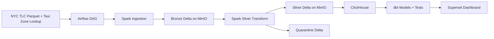

# NYC Taxi Data Platform

Engineering-grade compact data platform for the Nexlab Data Engineer Internship Entrance Project.

## Overview

This project builds an end-to-end batch data platform on NYC TLC Yellow Taxi Trip Records and Taxi Zone Lookup data. The target path is:

1. Ingest NYC TLC Parquet files into Bronze Delta tables on MinIO.
2. Transform, validate, deduplicate, and quarantine bad records with Apache Spark.
3. Load Silver data into ClickHouse.
4. Build dbt staging, dimensions, facts, and analytics marts.
5. Serve a Superset dashboard from ClickHouse.
6. Orchestrate the whole flow with Airflow.

The priority is a small, complete, explainable pipeline rather than a wide but fragile demo.

## Architecture

See [docs/design.md](docs/design.md) and [docs/architecture.mmd](docs/architecture.mmd).



## Quick Start

Local setup should stay within five steps:

1. Copy `.env.example` to `.env` and adjust local ports or credentials if needed.
2. Run `make docker-up`.
3. Run `make pipeline-sample` for the small test path.
4. Run `make dbt-run && make dbt-test`.
5. Open Superset and review the dashboard.

## Current Phase

Phase 2 adds the local Docker Compose stack. Pipeline implementation starts in later phases.

## Commands

```bash
python -m pip install -r requirements-dev.txt
make lint
make format
make test
make docker-up
make docker-logs
make docker-down
make pipeline-sample
make dbt-run
make dbt-test
```

On Windows machines without `make`, run the equivalent commands directly:

```powershell
python -m ruff check src tests dags scripts
python -m black --check src tests dags scripts
python -m pytest
docker compose --env-file .env up -d
docker compose --env-file .env logs -f --tail=200
docker compose --env-file .env down
```

## Docker Stack

Create a local environment file before starting services:

```bash
cp .env.example .env
docker compose --env-file .env config
make docker-up
make docker-logs
make docker-down
```

The Compose stack starts:

- MinIO object storage.
- Spark master and one Spark worker.
- ClickHouse serving database.
- Airflow Postgres metadata database.
- Airflow webserver and scheduler.
- Superset BI server.

The stack uses a shared Docker network and named volumes for service state. Local values in `.env.example` are development-only defaults and should be changed before any non-local deployment.

## Dataset Policy

Production/default runs must use enough NYC TLC Yellow Taxi monthly files to satisfy at least one threshold:

- at least 20 million records, or
- at least 10 GiB raw data.

Small samples are allowed only for unit and integration tests. A validation script will fail fast if the configured production month range does not meet the threshold.

## Configuration, Logging, and Metrics

Pipeline jobs read configuration from `configs/pipeline.yml` plus environment variables. For local runs, copy `.env.example` to `.env`; process environment variables override values from `.env`.

`configs/pipeline.yml` may reference variables with `${VAR_NAME}`. Secrets such as MinIO credentials stay in `.env` and are not embedded in source code.

Structured logs are JSON objects with fields such as `event`, `job_name`, `batch_id`, `timestamp`, `level`, and job-specific metadata. Metrics are written as JSONL to `METRICS_OUTPUT_PATH`, which defaults to `metrics/pipeline_metrics.jsonl`.

Standard metrics include:

- `job_duration_seconds`
- `records_processed`
- `invalid_records_count`
- `duplicates_dropped`
- `data_freshness_hours`

## UI Access

- MinIO Console: `http://localhost:9001`
- Airflow UI: `http://localhost:8080`
- Superset UI: `http://localhost:8088`
- ClickHouse HTTP: `http://localhost:8123`
- ClickHouse Native: `localhost:9009`
- Spark Master UI: `http://localhost:18080`
- Spark Worker UI: `http://localhost:18081`

## Documentation

- [Design Doc](docs/design.md)
- [Data Dictionary](docs/data_dictionary.md)
- [Runbook](docs/runbook.md)
- [Presentation Outline](docs/presentation_outline.md)
