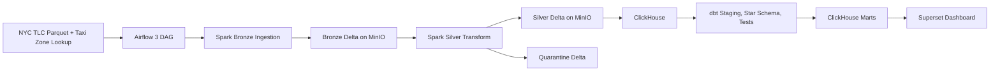

# Design Document

## Problem Statement

This project builds a compact end-to-end data platform for the Nexlab Data Engineer Internship Entrance Project. The goal is not to maximize feature count, but to demonstrate a complete, explainable data engineering system: real data, distributed processing, lakehouse storage, orchestration, data quality, observability, tests, CI, containerization, and a live BI path.

The business domain is NYC yellow taxi operations. The serving layer should answer practical questions: how trips and revenue change over time, where demand is concentrated, how payment type relates to revenue/tips, and which hours have the highest demand.

## Dataset

The primary dataset is the public NYC TLC Yellow Taxi Trip Records in Parquet format. The joinable lookup dataset is the public NYC TLC Taxi Zone Lookup CSV. The taxi records contain trip timestamps, pickup/dropoff location IDs, fares, tips, payment type, vendor, and rate code. The lookup maps taxi zone IDs to borough, zone, and service zone.

Production/default runs must satisfy at least one entrance-project threshold:

- at least 20 million records, or
- at least 10 GiB raw data.

The dataset gate discovers monthly Yellow Taxi files from the configured start/end month and uses HTTP `HEAD` size checks where available. Because public Parquet files are compressed and object metadata may be limited, `configs/pipeline.yml` also contains month-level record-count metadata for the default full-mode range. `sample_mode=true` bypasses the threshold only for CI and local smoke testing, and logs that it is not a production dataset.

## Architecture

Airflow owns control flow, Spark owns distributed ingestion and transformation, MinIO provides S3-compatible object storage, Delta Lake provides open table storage, ClickHouse provides OLAP serving, dbt builds the modeled layer and tests, and Superset provides BI.

## Data Flow

1. Discover monthly Yellow Taxi source URLs from `DATASET_START_MONTH` and `DATASET_END_MONTH`.
2. Validate full-mode dataset size/record threshold before expensive pipeline work.
3. Ingest source Parquet files into Bronze Delta with source metadata.
4. Normalize schema, cast types, validate business rules, generate deterministic `trip_id`, derive analytical columns, and deduplicate trips.
5. Write valid rows to Silver Delta and invalid rows to Quarantine Delta.
6. Load Silver records into ClickHouse using month-partition replacement.
7. Run dbt seeds, staging models, dimensions, fact table, marts, and dbt tests.
8. Query ClickHouse marts from Superset.

## Storage Design

Bronze stores near-raw source rows with lineage columns: `source_file`, `source_url`, `ingestion_timestamp`, `batch_id`, `dataset_year`, and `dataset_month`. It is intentionally close to the source so failed downstream logic can be replayed without re-downloading data.

Silver stores cleaned and validated trip records with stable names, typed fields, `trip_id`, `pickup_date`, `pickup_hour`, `trip_duration_minutes`, and `average_speed_mph`.

Quarantine stores invalid records instead of silently dropping them. Each row has `error_reason`, `quarantine_timestamp`, `batch_id`, and `source_file` so data quality issues can be reviewed after a run.

ClickHouse stores `silver_yellow_taxi_trips` for dbt. dbt then materializes the star schema and analytics marts in ClickHouse for dashboard queries.

## Partition Strategy

Bronze is partitioned by `dataset_year` and `dataset_month` because source files are published monthly. This aligns ingestion idempotency with the source file boundary and avoids rewriting unrelated months.

Silver is partitioned by pickup year/month derived from `pickup_datetime`. Most analysis, freshness checks, and ClickHouse loads are time-based, so pickup month is the natural operational boundary.

ClickHouse partitions `silver_yellow_taxi_trips` by `toYYYYMM(pickup_datetime)` and orders by `(pickup_date, pickup_location_id, dropoff_location_id, trip_id)`. This supports dashboard time filters, location analysis, and deterministic trip-level checks.

## Processing Design

Spark is the primary processing engine. The pipeline does not use pandas or notebooks as the production execution path. Spark reads Parquet, writes Delta, applies validation rules, performs deduplication, and writes to ClickHouse through JDBC.

`trip_id` is a SHA-256 hash of business columns: vendor, pickup/dropoff timestamps, pickup/dropoff locations, fare, total amount, and distance. This makes deduplication deterministic across reruns. Late-arriving valid rows are merged into Silver by `trip_id`; an incoming row updates an existing row only when its `ingestion_timestamp` is newer or equal.

## Data Modeling

The dbt serving layer uses a star schema.

- `fact_trips` grain: one row equals one validated yellow taxi trip.
- `fact_trips` primary key: `trip_id`.
- Dimensions: `dim_date`, `dim_time`, `dim_location`, `dim_vendor`, `dim_payment_type`, and `dim_rate_code`.
- Analytics marts: `mart_daily_revenue`, `mart_hourly_demand`, `mart_location_performance`, and `mart_payment_summary`.

The marts are deliberately dashboard-shaped. They avoid forcing Superset to repeat heavy joins for common questions, while keeping the grain clear enough to explain during review.

## Data Quality

Spark validation checks include:

- pickup and dropoff timestamps are present,
- dropoff is after pickup,
- trip distance is positive,
- fare and total amount are non-negative,
- pickup and dropoff location IDs are present.

Invalid rows go to Quarantine with reasons. Duplicate valid rows are removed by `trip_id`.

dbt tests include `trip_id` not-null/unique checks, timestamp not-null checks, accepted payment type values, relationships from pickup/dropoff locations to `dim_location`, and expression tests for fare, total amount, distance, and timestamp ordering. A failing `dbt_test` blocks the Airflow success task and marks the serving layer untrusted.

## Orchestration

Airflow 3 runs `nyc_taxi_monthly_pipeline` manually with params: `start_month`, `end_month`, `sample_mode`, and `batch_id`. The DAG tasks are:

1. `validate_dataset_size`
2. `check_source_available`
3. `ingest_bronze`
4. `transform_silver`
5. `create_clickhouse_tables`
6. `load_clickhouse`
7. `dbt_seed`
8. `dbt_run`
9. `dbt_test`
10. `log_pipeline_success`

The DAG uses `retries=2`, `retry_delay=5 minutes`, and `catchup=False`. dbt runs in the dedicated Docker image `dnquocdat/nyc-taxi-dbt:latest`, pulled by Airflow `DockerOperator`, so the Airflow image does not need dbt installed directly.

## Observability

Jobs use structured JSON logs rather than bare prints. Logs include event name, job name, batch ID when available, timestamp, level, and job-specific metadata. Metrics are written as JSONL to `METRICS_OUTPUT_PATH` for review after a run.

Tracked metrics include `job_duration_seconds`, `records_processed`, `records_read`, `records_written`, `valid_records_count`, `invalid_records_count`, `invalid_records_ratio`, `duplicates_dropped`, and `data_freshness_hours` where available.

## Secrets And Security

Credentials and connection details are read from `.env` and `configs/pipeline.yml`. `.env` is ignored by git; `.env.example` contains local development defaults only, such as `admin/admin` or `minioadmin/minioadmin`. These are intentionally easy for a local demo and must be changed for any non-local deployment.

The code avoids hard-coded real secrets. Superset and Airflow read local credentials from environment variables. The Superset ClickHouse URI helper can redact the password by default and only prints the full URI when explicitly called with `--show-password`.

## Idempotency And Failure Handling

Bronze uses a JSONL manifest keyed by `source_url`. Successful source files are skipped on rerun; if the same source must be ingested again, only rows for that `source_url` are replaced.

Silver deduplicates by deterministic `trip_id` and uses Delta merge for late-arriving valid rows. Invalid rows are preserved in Quarantine.

ClickHouse loads replace affected pickup-month partitions before appending the current Silver rows. This is simpler and more deterministic for local demos than relying on background deduplication in a `ReplacingMergeTree`.

dbt tests block downstream trust. Airflow retries transient task failures, but persistent data quality failures remain visible and require a code/config/data fix.

## Trade-offs

Docker Compose keeps the project runnable and inspectable in one week, but it is not a production deployment pattern. MinIO + Delta Lake gives an open lakehouse path without cloud dependencies, at the cost of more Spark/S3A configuration. ClickHouse is fast for BI and simple to run locally, but mutations for partition replacement should be monitored at larger scale.

The taxi zone seed committed in the repo is header-only to avoid fake production lookup data. Full demo runs should download the official NYC TLC lookup before `dbt seed`.

Superset dashboard creation is documented manually. A committed export would be better, but export IDs depend on a running Superset metadata database and populated ClickHouse tables.

## Scaling To 10x

At 10x data volume, the main pressure points are Spark executor capacity, object storage throughput, ClickHouse partition/mutation cost, and dashboard latency. The design can scale by adding Spark workers, tuning shuffle partitions, using incremental dbt materializations, separating raw and serving storage, moving ClickHouse to a larger cluster, and using async dashboard refresh/caching policies.

## Cost And Runtime Discussion

Local cost is near zero beyond machine resources, but full multi-month runs consume disk, memory, CPU, and download bandwidth. The default Docker resources are intentionally modest for development; full runs may require increasing Spark worker memory, ClickHouse disk, and Docker Desktop resource limits.

For cloud deployment, costs would shift to object storage, Spark compute, ClickHouse compute/storage, orchestration runtime, and BI hosting. The design keeps those components separable so a future version can move one layer at a time.

## Improvements With More Time

- Export and version a Superset dashboard after building it against a populated environment.
- Replace Airflow startup package installation with a custom pinned Airflow image.
- Add Great Expectations or Soda quality reports alongside dbt tests.
- Add OpenLineage or Marquez for lineage.
- Add Terraform or Helm for a cloud deployment.
- Add performance benchmarks and data volume regression tests.
